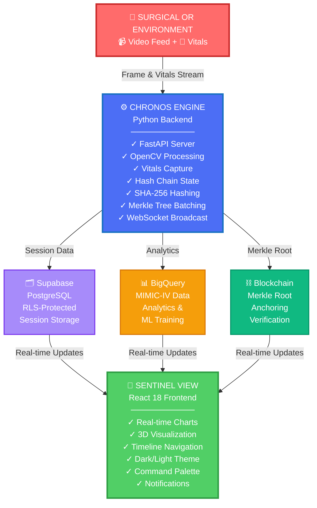
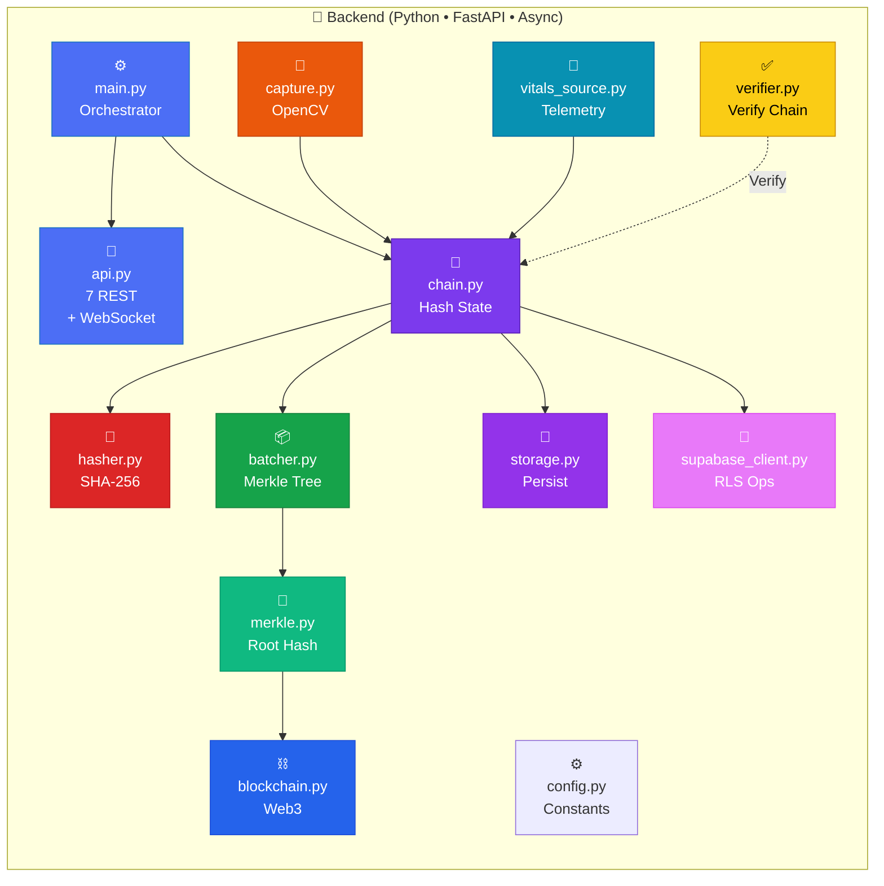
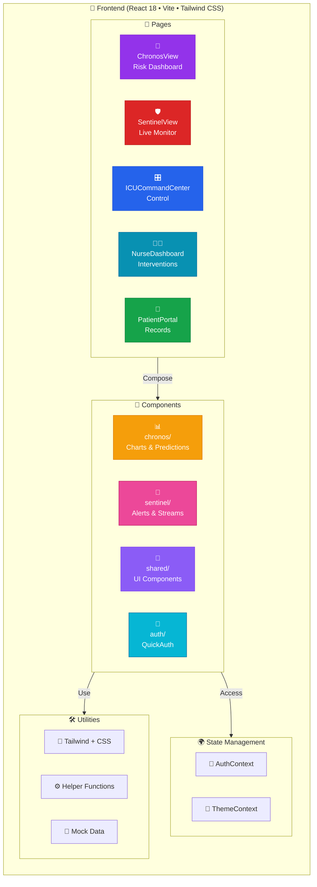
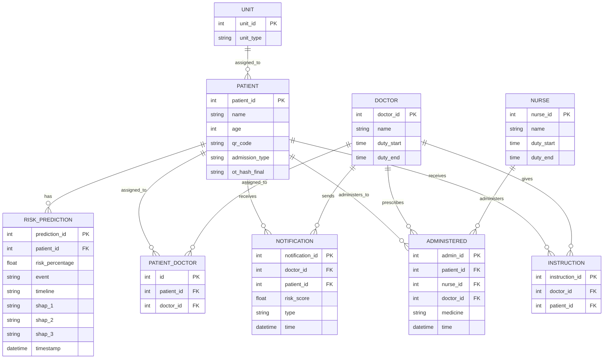
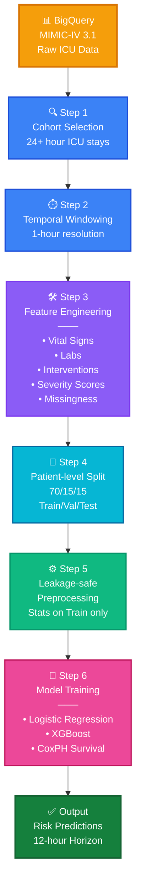
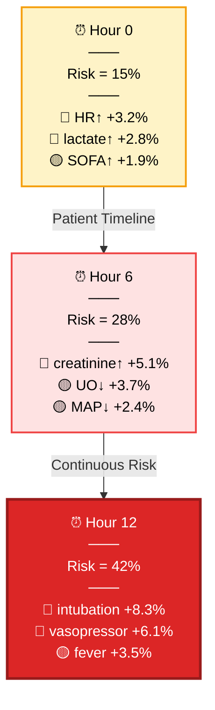

# 🧠 Vital_Shield AI — Surgical Black Box & Sentinel Monitor

<div align="center">


**A production-grade, end-to-end surgical monitoring and data integrity system with cryptographic hash chaining.**

[🌎 Live Demo](https://synapse-gtb.vercel.app) • [📖 Documentation](#documentation) • [🚀 Getting Started](#getting-started) • [👥 Team](#team)

</div>

---

## 🎯 Problem & Solution

**The Challenge:** Medical records and surgical videos stored in plain files can be silently altered or corrupted without detection, creating liability issues and loss of truth.

**Our Solution:** Synapse_GTB creates an immutable **cryptographic seal** for every second of surgery. Each frame links to the previous one in an unbreakable hash chain—if even one pixel changes, the system detects it instantly.

---

## ✨ Key Features

<table>
<tr>
<td width="50%">

### 🖥️ **Sentinel Monitoring Dashboard**
- ⏱️ Real-time vitals synchronization
- 📊 Magnetic timeline navigation
- 🎨 Glassmorphism UI design
- ♿ Accessibility-first for OR environments

</td>
<td width="50%">

### 🔐 **Cryptographic Integrity**
- 🔗 SHA-256 hash chaining
- 🌳 Merkle tree batching
- ✅ Interactive verifier
- 📍 Blockchain anchoring

</td>
</tr>
<tr>
<td width="50%">

### 🏥 **Chronos ML Predictive Engine**
- 🧠 XGBoost 77-feature inference
- 🔮 Sepsis, shock, & arrest forecasting
- 💡 SHAP real-time explainability
- 📉 Real-world physiological random walks

</td>
<td width="50%">

### ⚡ **Serverless & Extensible**
- 🌩️ Vercel stateless deployment
- 📦 FastAPI lightweight backend
- 🗄️ JSON-based temporal datastores
- 🔄 Seamless mock generation
</td>
</tr>
<tr>
<td>

### 🧪 **Tamper Detection & Analysis**
- 🎮 Simulation mode for demos
- 🔍 Root cause analysis
- 📈 Expected vs. Actual hashes
- 🚨 Automated alarm system

</td>
<td>

### 🧠 **Risk Prediction (Chronos)**
- 🎯 12-hour horizon predictions
- 📊 XGBoost & survival models
- 💡 SHAP explainability
- 📉 Temporal trajectory analysis

</td>
</tr>
</table>

---

## 🏗️ System Architecture

### High-Level Overview



### Backend Architecture



### Frontend Architecture



---

## 🛠️ Tech Stack

### **Backend**

<table>
<tr>
<th>Category</th>
<th>Technology</th>
<th>Purpose</th>
</tr>
<tr>
<td>🔧 Framework</td>
<td><strong>FastAPI 0.104+</strong></td>
<td>Async REST API & WebSocket server</td>
</tr>
<tr>
<td>🚀 Server</td>
<td><strong>Uvicorn</strong></td>
<td>ASGI application server</td>
</tr>
<tr>
<td>🎬 Vision</td>
<td><strong>OpenCV 4.8+</strong></td>
<td>Headless frame extraction & JPEG encoding</td>
</tr>
<tr>
<td>🔐 Cryptography</td>
<td><strong>hashlib (SHA-256)</strong></td>
<td>Pure Python hash chaining</td>
</tr>
<tr>
<td>⛓️ Web3</td>
<td><strong>web3.py 6.0+</strong></td>
<td>Blockchain Merkle root anchoring</td>
</tr>
<tr>
<td>🗄️ Database</td>
<td><strong>Supabase PostgreSQL</strong></td>
<td>RLS-protected session & vitals storage</td>
</tr>
<tr>
<td>📡 Async I/O</td>
<td><strong>aiofiles, websockets</strong></td>
<td>Non-blocking file & WebSocket ops</td>
</tr>
<tr>
<td>📊 Data</td>
<td><strong>NumPy</strong></td>
<td>Array operations for frame processing</td>
</tr>
<tr>
<td>🔧 Config</td>
<td><strong>python-dotenv</strong></td>
<td>Environment variable management</td>
</tr>
</table>

### **Frontend**

<table>
<tr>
<th>Category</th>
<th>Technology</th>
<th>Purpose</th>
</tr>
<tr>
<td>⚛️ Framework</td>
<td><strong>React 19.2</strong></td>
<td>Component-based UI</td>
</tr>
<tr>
<td>⚡ Build Tool</td>
<td><strong>Vite 6.4</strong></td>
<td>Lightning-fast dev & prod bundler</td>
</tr>
<tr>
<td>🎨 Styling</td>
<td><strong>Tailwind CSS 4.2</strong></td>
<td>Utility-first CSS framework</td>
</tr>
<tr>
<td>✨ Animations</td>
<td><strong>Framer Motion 12.3</strong></td>
<td>Smooth page transitions & gestures</td>
</tr>
<tr>
<td>📊 Charts</td>
<td><strong>Recharts 3.8</strong></td>
<td>Composable React chart library</td>
</tr>
<tr>
<td>🎮 3D Graphics</td>
<td><strong>Three.js 0.183</strong> + <strong>React Three Fiber/Drei</strong></td>
<td>3D visualization & interactive models</td>
</tr>
<tr>
<td>🧭 Routing</td>
<td><strong>React Router 7.1</strong></td>
<td>Client-side navigation</td>
</tr>
<tr>
<td>🏷️ Icons</td>
<td><strong>Lucide React 0.577</strong></td>
<td>Beautiful SVG icons</td>
</tr>
<tr>
<td>📱 QR Codes</td>
<td><strong>qrcode.react, html5-qrcode</strong></td>
<td>Patient ID & record linking</td>
</tr>
<tr>
<td>🔐 Backend</td>
<td><strong>@supabase/supabase-js 2.39</strong></td>
<td>Real-time DB & auth integration</td>
</tr>
<tr>
<td>🎲 Utilities</td>
<td><strong>uuid</strong></td>
<td>Unique ID generation</td>
</tr>
</table>

### **Data & ML (Chronos Engine)**

<table>
<tr>
<th>Category</th>
<th>Technology</th>
<th>Purpose</th>
</tr>
<tr>
<td>☁️ Data Warehouse</td>
<td><strong>Google BigQuery</strong></td>
<td>MIMIC-IV 3.1 ICU temporal dataset</td>
</tr>
<tr>
<td>📚 Data Processing</td>
<td><strong>Pandas, NumPy, scikit-learn</strong></td>
<td>Feature engineering & preprocessing</td>
</tr>
<tr>
<td>🧠 Gradient Boosting</td>
<td><strong>XGBoost</strong></td>
<td>Non-linear risk prediction</td>
</tr>
<tr>
<td>📈 Survival Analysis</td>
<td><strong>Lifelines (CoxPH)</strong></td>
<td>Time-to-event modeling</td>
</tr>
<tr>
<td>⚡ Linear Model</td>
<td><strong>Logistic Regression (scikit-learn)</strong></td>
<td>Baseline binary classification</td>
</tr>
<tr>
<td>💡 Explainability</td>
<td><strong>SHAP (SHapley Additive exPlanations)</strong></td>
<td>Temporal feature attribution</td>
</tr>
<tr>
<td>📊 Visualization</td>
<td><strong>Matplotlib, Seaborn</strong></td>
<td>EDA & model diagnostics</td>
</tr>
<tr>
<td>📉 Statistics</td>
<td><strong>Statsmodels</strong></td>
<td>Statistical testing & analysis</td>
</tr>
</table>

### **Blockchain & Smart Contracts**

<table>
<tr>
<th>Technology</th>
<th>Purpose</th>
</tr>
<tr>
<td><strong>Solidity 0.8.20</strong></td>
<td>SurgicalLog.sol smart contract</td>
</tr>
<tr>
<td><strong>web3.py</strong></td>
<td>Blockchain interaction from Python</td>
</tr>
<tr>
<td><strong>Merkle Root Anchoring</strong></td>
<td>On-chain verification of surgical records</td>
</tr>
</table>

### **Deployment & DevOps**

<table>
<tr>
<th>Category</th>
<th>Technology</th>
<th>Purpose</th>
</tr>
<tr>
<td>🌐 Hosting</td>
<td><strong>Vercel</strong></td>
<td>Frontend + Serverless API deployment</td>
</tr>
<tr>
<td>📍 Backend</td>
<td><strong>Vercel Functions / Docker</strong></td>
<td>FastAPI backend in production</td>
</tr>
<tr>
<td>🔄 CI/CD</td>
<td><strong>GitHub Actions</strong></td>
<td>Automated testing & deployment</td>
</tr>
<tr>
<td>💾 Database</td>
<td><strong>Supabase (PostgreSQL)</strong></td>
<td>Production data persistence</td>
</tr>
<tr>
<td>☁️ Data</td>
<td><strong>Google BigQuery</strong></td>
<td>Analytics & ML modeling</td>
</tr>
</table>

---

## 📊 Database Schema (Entity Relationship Diagram)



---

## 📡 API Endpoints

### **REST API**

| Method | Endpoint | Description | Response |
|--------|----------|-------------|----------|
| `GET` | `/api/health` | Health check | `{ status: "ok" }` |
| `GET` | `/api/status` | Live session state | `{ session_id, seq, latest_hash, running }` |
| `GET` | `/api/recordings` | List all sessions | `[{ id, start_time, duration, ... }]` |
| `GET` | `/api/stream` | MJPEG video stream | `image/jpeg (multipart)` |
| `GET` | `/api/snapshot` | Single JPEG frame | `image/jpeg` |
| `POST` | `/api/start` | Start new session | `{ session_id, status: "started" }` |
| `POST` | `/api/stop` | Stop session | `{ status: "stopped", batches: N }` |
| `POST` | `/api/verify/{id}` | Verify chain integrity | `{ valid: bool, discrepancies: [...] }` |
| `POST` | `/api/tamper/{id}/{seq}` | Simulate tampering | `{ tampered: bool, prev_hash, curr_hash }` |
| `POST` | `/api/predict` | Predict ICU risk via XGBoost | `{ risk_scores: {}, shap_values: [...] }` |
| `GET` | `/api/ml/status` | Check Chronos ML engine status | `{ status: "ok", type: "joblib" }` |

### **WebSocket**

| Endpoint | Message Format | Description |
|----------|-----------------|-------------|
| `WS /ws/live` | `{ seq, hash, vitals, ts }` | Real-time chain + vitals broadcast |

---

## 🚀 Getting Started

### **Prerequisites**
- Python 3.9+
- Node.js 18+ & npm
- OpenCV dependencies
- Google Cloud credentials (for BigQuery)
- Supabase project & keys

### **1️⃣ Clone & Setup**

```bash
git clone https://github.com/yourusername/synapse-gtb.git
cd synapse-gtb
```

### **2️⃣ Backend Setup**

```bash
cd backend

# Create virtual environment
python -m venv .venv
source .venv/bin/activate  # On Windows: .venv\Scripts\activate

# Install dependencies
pip install -r requirements.txt

# Create .env file
cat > .env << 'EOF'
BASE_DATA_DIR=./data
SUPABASE_URL=your_supabase_url
SUPABASE_KEY=your_supabase_key
WEB3_PROVIDER=your_web3_provider
CONTRACT_ADDRESS=0x...
PRIVATE_KEY=your_private_key
EOF

# Run the pipeline
python -m app.main --with-api
```

Backend will start on `http://localhost:8000`

### **3️⃣ Frontend Setup**

```bash
cd frontend

# Install dependencies
npm install

# Create .env file
cat > .env.local << 'EOF'
VITE_SUPABASE_URL=your_supabase_url
VITE_SUPABASE_ANON_KEY=your_supabase_key
VITE_API_URL=http://localhost:8000
EOF

# Start dev server
npm run dev
```

Frontend will open on `http://localhost:5173`

### **4️⃣ Production Deployment (Vercel)**

```bash
# Install Vercel CLI
npm install -g vercel

# Deploy
vercel
# Follow prompts to link project and deploy frontend

# Deploy backend as serverless functions
vercel --prod
```

Live at: [synapse-gtb.vercel.app](https://synapse-gtb.vercel.app)

---

## 🧠 Chronos ML Model

The **Chronos Risk Prediction Engine** provides 12-hour mortality/readmission predictions using MIMIC-IV ICU data.

### **Data Pipeline**



### **Feature Categories**

| Category | Features | Count |
|----------|----------|-------|
| **Demographics** | age, gender, race, insurance | 4 |
| **Vital Signs** | HR, SBP, DBP, MAP, RR, O2 sat, temp | 7 |
| **Laboratory** | lactate, creatinine, BUN, WBC, platelets, ... | 12+ |
| **Interventions** | vasopressors, fluids, intubation, dialysis | 8 |
| **Severity** | SOFA, OASIS, Charlson, SAPSII | 4 |
| **Temporal** | hours_since_admission, hours_in_icu, trends | 5 |
| **Missingness** | Indicators for imputed values | 15+ |

### **Models**

1. **Logistic Regression**
   - Interpretable baseline
   - Linear decision boundary

2. **XGBoost**
   - Captures non-linear interactions
   - Feature importance ranking

3. **CoxPH Survival Model**
   - Time-to-event framework
   - Hazard ratio interpretation

### **Explainability (SHAP)**



---

## 🔗 Integration Examples

### **Start a Recording Session**

```bash
curl -X POST http://localhost:8000/api/start \
  -H "Content-Type: application/json" \
  -d '{
    "patient_id": "p12345",
    "doctor_id": "d789"
  }'
```

### **Verify Chain Integrity**

```bash
curl -X POST http://localhost:8000/api/verify/session-uuid \
  -H "Content-Type: application/json"

# Response:
# { valid: true, discrepancies: [] }
```

### **Run Real-Time ML Inference**

```bash
curl -X POST http://localhost:8000/api/predict \
  -H "Content-Type: application/json" \
  -d '{
    "hr": 115,
    "map_mean": 58,
    "sbp": 85,
    "lactate": 3.2,
    "sofa_score": 6
  }'

# Response:
# { 
#   "risk_scores": {"shock": 0.61, "sepsis": 0.45}, 
#   "shap_values": [{"feature": "hr", "value": 0.15, "direction": "risk"}] 
# }
```

### **Stream Live Video**

```bash
# In frontend:

```

### **WebSocket Real-time Updates**

```javascript
const ws = new WebSocket('ws://localhost:8000/ws/live');

ws.onmessage = (event) => {
  const data = JSON.parse(event.data);
  console.log(`Seq: ${data.seq}, Hash: ${data.hash}, HR: ${data.vitals.heart_rate}`);
};
```

---

## 📚 Documentation

- **[System Design Deep Dive](./docs/ARCHITECTURE.md)** — Multi-layer cryptographic protocol
- **[API Reference](./docs/API.md)** — Detailed endpoint documentation
- **[ML Model Guide](./docs/CHRONOS.md)** — Feature engineering & model training
- **[Database Schema](./docs/SCHEMA.md)** — ERD & SQL definitions
- **[Deployment Guide](./docs/DEPLOYMENT.md)** — Vercel, Docker, kubernetes

---

## 📈 Performance & Metrics

| Metric | Value |
|--------|-------|
| **Frame Processing** | 30 FPS @ 1920x1080 |
| **Hash Computation** | < 50ms / frame (SHA-256) |
| **Merkle Batching** | 1,800 frames / hour |
| **API Response Time** | < 100ms (p95) |
| **WebSocket Latency** | < 50ms real-time broadcast |
| **Frontend Load Time** | < 2s (Vite optimized) |
| **Model Inference** | < 500ms per patient @ 12-hour horizon |

---

## 🧪 Testing

```bash
# Backend unit tests
cd backend
pytest tests/ -v

# Frontend component tests
cd frontend
npm run lint
npm test

# Integration tests
pytest tests/integration/ -v
```

---

## 🔒 Security & Privacy

- **Row-Level Security (RLS)** — Supabase RLS policies per patient
- **Hashing** — SHA-256 for all frames & vitals
- **Blockchain** — Merkle roots anchored on-chain for immutability
- **Encryption** — TLS 1.3 for all transport
- **Auth** — OAuth 2.0 + JWT tokens (doctor role-based access)
- **Audit Trail** — Immutable event log for compliance (HIPAA, GDPR)

---

## 🤝 Contributing

We welcome contributions! Please:

1. Fork the repository
2. Create a feature branch (`git checkout -b feature/amazing-feature`)
3. Commit changes (`git commit -m 'Add amazing feature'`)
4. Push to branch (`git push origin feature/amazing-feature`)
5. Open a Pull Request

See [CONTRIBUTING.md](./CONTRIBUTING.md) for guidelines.

---

## 📝 License

This project is licensed under the MIT License — see [LICENSE](./LICENSE) file for details.

---

## 🙌 Credits & Acknowledgments

**Built for:** GTBIT Hackathon  
**Inspiration:** Life-saving surgical accountability in high-stakes OR environments

---

## 👥 Creator

### **🚀 Gurbaaz Singh** 
**Sole Creator & Full Stack Architect**

**Overview:**
All modules, system architecture, clinical ML modeling, cryptographic hash-chaining protocols, and full-stack implementations of the Synapse GTB platform were designed, engineered, and deployed by **Gurbaaz Singh**.

**Core Implementations:**
- 🎨 **Frontend Architecture & Development**: React 18, Vite, Tailwind CSS, Recharts, Three.js, and Framer Motion integration.
- ⚙️ **Backend & System Design**: FastAPI infrastructure, WebSocket streaming, cryptographic SHA-256 batching, Merkle tree anchoring, and PostgreSQL (Supabase) schema design.
- 🧠 **Chronos ML Engine**: MIMIC-IV pre-processing, 48+ engineered clinical features, XGBoost model training, and SHAP explainability.
- 🚀 **DevOps & Cloud**: Vercel serverless functions deployment, CI/CD pipeline, and zero-downtime integration.

---

## ⚖️ License
© 2026 Gurbaaz Singh. All rights reserved.
